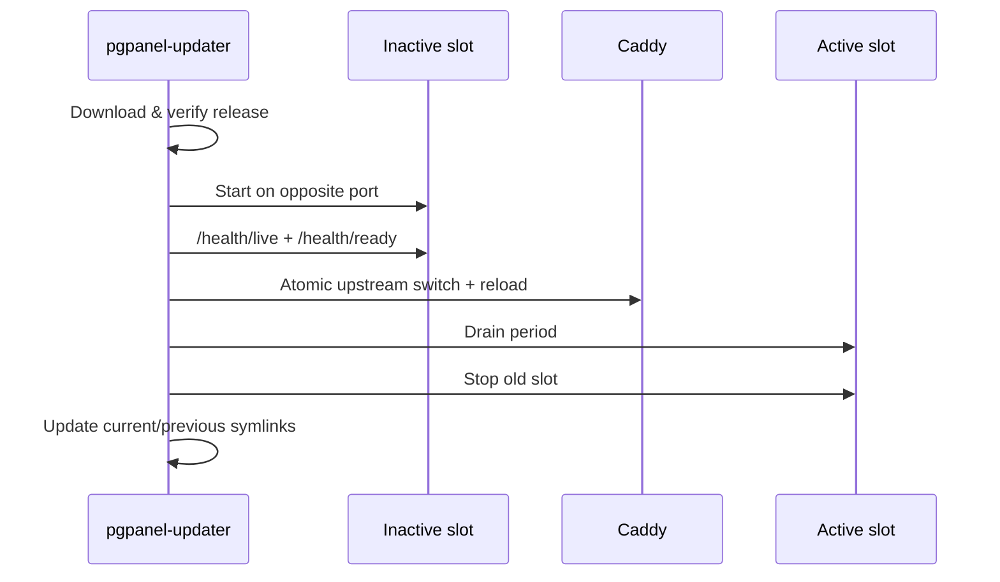
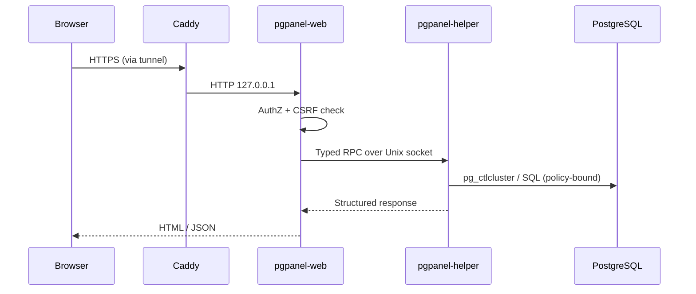

# Architecture

PgPanel is a multi-process Rust application designed for native deployment on Ubuntu Server 24.04 without container runtimes.

## Components

### pgpanel-web

- **User:** `pgpanel`
- **Bind:** `127.0.0.1:8081` (blue) or `127.0.0.1:8082` (green)
- **Stack:** Axum, Askama templates, HTMX, embedded static assets
- **Storage:** SQLite at `/var/lib/pgpanel/pgpanel.db`
- **Responsibilities:** HTTP UI, authentication, authorization, audit log, SQL editor proxy, monitoring samples

Communicates with `pgpanel-helper` exclusively via a Unix domain socket at `/run/pgpanel/helper.sock`.

### pgpanel-helper

- **User:** `root` (hardened systemd unit)
- **Bind:** Unix socket only
- **Responsibilities:** Invoke `postgresql-common` tools, read/write cluster configuration within policy, stream logs, emit audit events

The helper validates peer UID (must match `pgpanel`), enforces operation timeouts, and rejects any request outside the typed protocol.

### pgpanel-updater

- **Invocation:** CLI (`check`, `update`, `rollback`, `status`) and optional systemd timer
- **Responsibilities:** Download GitHub releases, verify signatures, extract to `/opt/pgpanel/releases/<version>`, run migrations, start inactive slot, health-check, switch Caddy upstream, drain and stop old slot

### Caddy

- **Bind:** `127.0.0.1:8080`
- **Config:** `/etc/caddy/Caddyfile` imports `/etc/caddy/pgpanel-upstream.caddy`
- **Role:** Reverse proxy to the active blue or green slot; health-aware upstream selection

## Directory layout

```
/opt/pgpanel/
  releases/<version>/bin/{pgpanel-web,pgpanel-helper,pgpanel-updater}
  current -> releases/<active>
  previous -> releases/<prior>
  state/{staging,backups,slots,update.lock}

/etc/pgpanel/
  pgpanel.toml
  signing.pub

/var/lib/pgpanel/
  pgpanel.db

/run/pgpanel/
  helper.sock
```

State is **never** stored inside versioned release directories.

## Blue-green deployment



Rollback reverses the Caddy upstream to the previous slot after health validation.

## Request flow



## Configuration

Single TOML file: `/etc/pgpanel/pgpanel.toml`. See [config/pgpanel.toml.example](config/pgpanel.toml.example).

Environment overrides:

| Variable | Overrides |
|----------|-----------|
| `PGPANEL_SECRET_KEY` | `app.secret_key` |
| `PGPANEL_SLOT` | `app.slot` |
| `PGPANEL_LISTEN` | `server.listen` |
| `PGPANEL_DATABASUS_API_KEY` | `databasus.api_key` |
| `PGPANEL_CONFIG` | Config file path (CLI) |

## Frontend build

Tailwind CSS is compiled at build time via Node.js. The compiled `static/css/app.css` is embedded or packaged in release archives. **Node is not required on production servers.**

## Health endpoints

| Endpoint | Purpose |
|----------|---------|
| `GET /health/live` | Process alive |
| `GET /health/ready` | SQLite + migrations + helper reachable |
| `GET /health/version` | Version, slot, architecture |

## Observability

- Structured JSON logs via journald (`SyslogIdentifier=pgpanel-*`)
- Append-only audit log in SQLite with optional hash chaining
- `scripts/diagnostics.sh` for support bundles (secrets redacted)

## Related documents

- [THREAT_MODEL.md](THREAT_MODEL.md)
- [docs/postgresql-permissions.md](docs/postgresql-permissions.md)
- [docs/cloudflare-tunnel.md](docs/cloudflare-tunnel.md)
