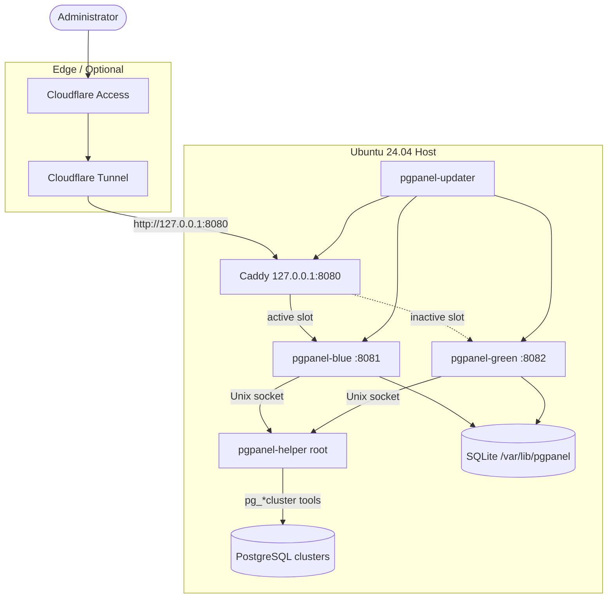

# PgPanel

PgPanel is a self-hosted PostgreSQL management panel for Ubuntu Server 24.04. It provides a secure web interface for managing native PostgreSQL clusters created with `postgresql-common`, without Docker or a Node.js runtime in production.

## Features

- Native cluster lifecycle (create, start, stop, restart, reload, rename, delete)
- Database and role management with granular permissions
- SQL editor with timeouts, row limits, and audit metadata
- Local authentication with Argon2id, TOTP, and role-based access control
- Blue-green zero-downtime updates from signed GitHub releases
- Optional Databasus backup integration
- Loopback-only binding with Caddy reverse proxy for Cloudflare Tunnel

## Screenshots

> Placeholder references — add PNG captures to `screenshots/` (see [screenshots/README.md](screenshots/README.md)).

| Dashboard | Clusters | SQL Editor |
|-----------|----------|------------|
|  |  |  |

## Architecture



See [ARCHITECTURE.md](ARCHITECTURE.md) for component details.

## Quick start (production)

```bash
curl -fsSL https://raw.githubusercontent.com/pgpanel/pgpanel/main/scripts/install.sh \
  -o /tmp/pgpanel-install.sh
# Inspect the installer, then pin the release signing key published out-of-band.
sudo env PGPANEL_SIGNING_PUBLIC_KEY_HEX='<64-hex-ed25519-public-key>' \
  bash /tmp/pgpanel-install.sh
```

Or from a clone:

```bash
sudo ./scripts/install.sh --signing-key ./signing.pub
```

Open `http://localhost:8080` and complete first-run administrator setup.

Full instructions: [INSTALL.md](INSTALL.md)

## Cloudflare Tunnel

Point your tunnel at the local Caddy listener:

```yaml
ingress:
  - hostname: panel.example.com
    service: http://127.0.0.1:8080
  - service: http_status:404
```

Details: [docs/cloudflare-tunnel.md](docs/cloudflare-tunnel.md)

## Updates and rollback

```bash
sudo ./scripts/update.sh
sudo ./scripts/rollback.sh
```

See [UPDATE.md](UPDATE.md).

## Development

Requirements: Rust 1.85+, Node.js 20+ (build-time CSS only).

```bash
make install-dev
PGPANEL_CONFIG=./config/pgpanel.toml cargo run -p pgpanel-helper -- --dev
PGPANEL_CONFIG=./config/pgpanel.toml cargo run -p pgpanel-web -- --dev
```

```bash
make test
make clippy
make frontend
make release
```

## Security warnings

- **Do not expose PgPanel or PostgreSQL ports directly to the internet.** Use Cloudflare Tunnel or a private network with Access policies.
- **PgPanel can destroy databases and clusters.** Restrict access to trusted administrators.
- **The helper runs as root** with a tightly scoped protocol — keep PgPanel updated and monitor audit logs.
- **Rotate `secret_key`** after installation if generated by the installer on a shared image.

See [SECURITY.md](SECURITY.md) and [THREAT_MODEL.md](THREAT_MODEL.md).

## Documentation

| Document | Description |
|----------|-------------|
| [INSTALL.md](INSTALL.md) | Production installation |
| [UPDATE.md](UPDATE.md) | Updates and rollback |
| [BACKUP.md](BACKUP.md) | Backup strategy |
| [ARCHITECTURE.md](ARCHITECTURE.md) | System design |
| [SECURITY.md](SECURITY.md) | Security practices |
| [THREAT_MODEL.md](THREAT_MODEL.md) | Threat analysis |
| [CONTRIBUTING.md](CONTRIBUTING.md) | Development guide |

## License

Apache-2.0 — see [LICENSE](LICENSE).
