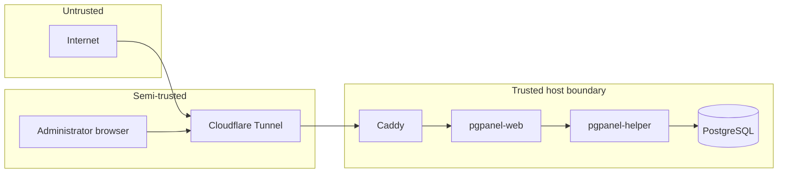

# Threat Model

This document describes the principal threats PgPanel is designed to mitigate and residual risks operators should understand.

## Assets

| Asset | Sensitivity | Location |
|-------|-------------|----------|
| PostgreSQL data | Critical | `/var/lib/postgresql` |
| PgPanel credentials | High | SQLite, sessions |
| Audit log | High | SQLite |
| Cluster configuration | High | `/etc/postgresql` |
| Release signing key | Critical | CI secrets / offline |
| Helper Unix socket | High | `/run/pgpanel/helper.sock` |

## Trust boundaries

## Threat actors

### External unauthenticated attacker

**Goals:** Gain panel access, execute SQL, destroy data.

**Mitigations:**

- No public bind; tunnel + Cloudflare Access recommended
- Rate-limited login, lockout, Argon2id passwords
- CSRF tokens on state-changing requests
- Session cookies HttpOnly + Secure + SameSite
- No default credentials after first-run setup

**Residual risk:** Weak administrator passwords; misconfigured public exposure.

### Authenticated malicious insider

**Goals:** Escalate privileges, exfiltrate data, destroy clusters.

**Mitigations:**

- Role-based permissions (owner/admin/operator/viewer)
- Server-side authorization on every action
- Destructive ops require re-auth, confirmation phrase, optional TOTP
- Append-only audit log with optional hash chaining
- Superuser creation disabled by default

**Residual risk:** Compromised owner account has full panel capabilities.

### Compromised web process

**Goals:** Escalate to root, execute arbitrary commands.

**Mitigations:**

- Web runs as unprivileged `pgpanel` user
- Helper validates peer UID on Unix socket
- Typed protocol — no arbitrary command endpoint
- Helper uses exec with absolute paths and separate argv elements
- Input validation on cluster names, ports, identifiers

**Residual risk:** Helper exposes powerful cluster operations to any caller that bypasses UID check (kernel/socket misconfiguration).

### Supply chain attacker

**Goals:** Distribute malicious release binaries.

**Mitigations:**

- SHA-256 checksums in `SHA256SUMS`
- Ed25519 signature over checksums file
- Pinned public key at `/etc/pgpanel/signing.pub`
- HTTPS-only downloads from GitHub
- Maximum download size enforced

**Residual risk:** Compromised signing key or failure to pin public key.

### Network attacker (MITM)

**Goals:** Intercept sessions, inject updates.

**Mitigations:**

- TLS at tunnel edge
- `secure` session cookies when behind HTTPS
- rustls for outbound HTTPS (updater)
- Trusted proxy configuration for client IP

**Residual risk:** HTTP-only access without tunnel (local development).

## STRIDE summary

| Category | Example | Mitigation |
|----------|---------|------------|
| Spoofing | Session hijack | Secure cookies, rotation, HTTPS |
| Tampering | Config file edit | Permissions, atomic writes, validation |
| Repudiation | Deny admin action | Audit log |
| Information disclosure | Error messages | Safe user-facing errors; no secret logging |
| Denial of service | Login flood | Rate limits; query timeouts |
| Elevation of privilege | Web → root | Unix socket UID check; no shell |

## Out of scope

PgPanel does **not** protect against:

- Root compromise of the host OS
- Direct PostgreSQL exposure on the network
- Physical access to the server
- Malicious PostgreSQL extensions installed outside panel policy
- Administrator intentionally running destructive SQL

## Recommendations for operators

1. Place PgPanel behind Cloudflare Access with MFA
2. Never expose port 5432 or 8080 publicly
3. Enable TOTP for all admin users
4. Monitor audit log for anomalous cluster deletions
5. Keep signing keys offline; rotate on compromise
6. Test rollback procedure before enabling auto-updates

See [SECURITY.md](SECURITY.md) for reporting vulnerabilities.
